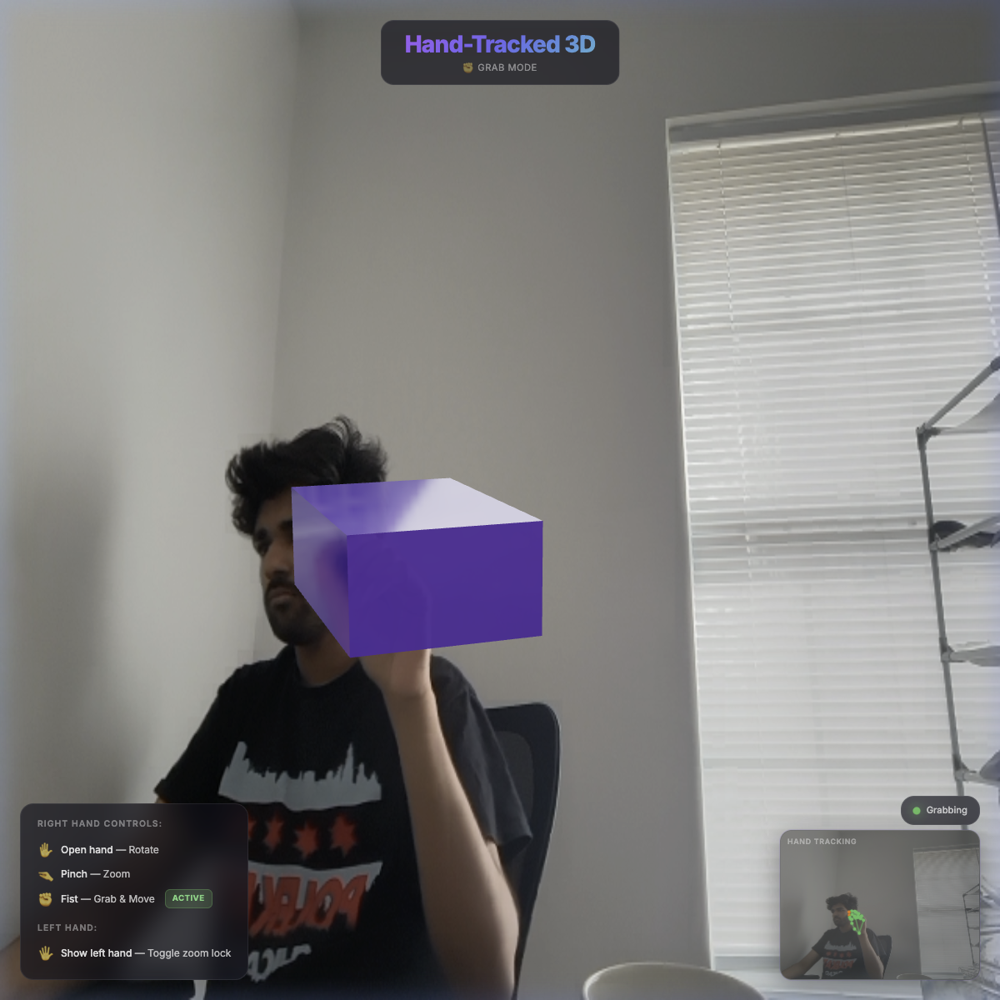

<div align="center">

# ✋ Hand-Tracked 3D

**An AR-style web experience where your hand gestures control a 3D object in real time**

[](https://react.dev)
[](https://threejs.org)
[](https://mediapipe.dev)
[](https://vite.dev)
[](https://tailwindcss.com)

<br />



<br />

*A glossy purple cube floats over your live webcam feed. Rotate it with an open hand, scale it with a pinch, grab and move it with a fist — all tracked in real time through your browser.*

</div>

---

## ✨ Features

| Gesture | Action | Hand |
|---------|--------|------|
| ✋ **Open hand** | Rotate the 3D object | Right |
| 🤏 **Pinch** | Zoom (scale) the object | Right |
| ✊ **Fist** | Grab & move the object | Right |
| 🖐️ **Show hand** | Toggle zoom lock on/off | Left |

### What makes it special

- 🎥 **Live webcam AR** — The 3D object composites over your camera feed in real time
- 🧠 **ML-powered tracking** — MediaPipe Hands runs entirely in-browser (no server needed)
- 🎨 **Premium visual design** — Glassmorphism UI, gradient text, smooth 60fps animations
- 🔒 **Zoom lock** — Use your left hand to freeze the scale while continuing to rotate
- 📹 **PIP hand visualizer** — See your tracked hand landmarks in a picture-in-picture overlay
- ⚡ **Zero-latency architecture** — Global refs + `useFrame()` bypass React re-renders for buttery-smooth 3D updates

---

## 🚀 Quick Start

### Prerequisites

- [Node.js](https://nodejs.org) (v18+)
- A webcam
- A modern browser (Chrome / Edge recommended)

### Install & Run

```bash
# Clone the repository
git clone https://github.com/sucheth/hand-tracked-3d.git
cd hand-tracked-3d

# Install dependencies
npm install

# Start the dev server
npm run dev
```

Open **http://localhost:5173** and allow camera access when prompted.

---

## 🏗️ Architecture

```
src/
├── main.jsx              # Entry point (no StrictMode — critical for MediaPipe WASM)
├── App.jsx               # 3D canvas, webcam background, UI overlays, state management
├── index.css             # All styles (Tailwind + custom glassmorphism CSS)
└── components/
    └── HandTracker.jsx   # MediaPipe integration, gesture detection, landmark drawing
```

### Performance Design

The most critical architectural decision: **high-frequency 3D updates never touch React state.**

```
HandTracker → writes to global refs → useFrame() reads refs every frame (60fps)
                                              ↓
                                    THREE.MathUtils.lerp → smooth interpolation
```

- **`useState`** is used only for UI indicators (tracking status, zoom lock badge, etc.)
- **`useFrame()`** runs every animation frame, reading from module-level `{ current: value }` refs
- Result: zero re-renders for 3D transforms = no jank, no lag

### Gesture Detection

| Gesture | How it's detected |
|---------|-------------------|
| **Rotation** | Landmark 9 (Middle Finger MCP) position mapped to euler angles |
| **Pinch/Zoom** | Euclidean distance between Landmark 4 (thumb tip) and Landmark 8 (index tip) |
| **Fist** | ≥3 of 4 fingertips closer to wrist than their knuckles (×0.9 threshold) |
| **Zoom Lock** | Left hand visible for 10 consecutive frames (~⅓ second debounce) |

---

## 🛠️ Tech Stack

| Technology | Purpose |
|-----------|---------|
| **React 19** | UI framework |
| **React Three Fiber** | Declarative Three.js in React |
| **Drei** | R3F helpers (Environment, HDRI) |
| **Three.js** | 3D rendering, math utilities |
| **MediaPipe Hands** | Real-time hand landmark detection |
| **Tailwind CSS 4** | Utility-first styling |
| **Vite 7** | Build tool & dev server |

---

## ⚠️ Known Gotchas

| Issue | Solution |
|-------|----------|
| MediaPipe WASM double-init crash | Removed `<StrictMode>`, added `isInitializedRef` guard |
| Mirrored webcam coordinates | X-axis inverted for grab position; MediaPipe labels are mirrored |
| State-driven 3D updates are laggy | Uses global refs + `useFrame()` instead of `useState` |
| MediaPipe Camera utility is flaky | Uses `requestAnimationFrame` loop instead |
| False positive second hand detection | 10-frame debounce threshold |
| Stale callbacks in `onResults` | Callbacks stored in refs, synced via `useEffect` |

---

## 📄 License

MIT © [Sucheth](https://github.com/sucheth)
